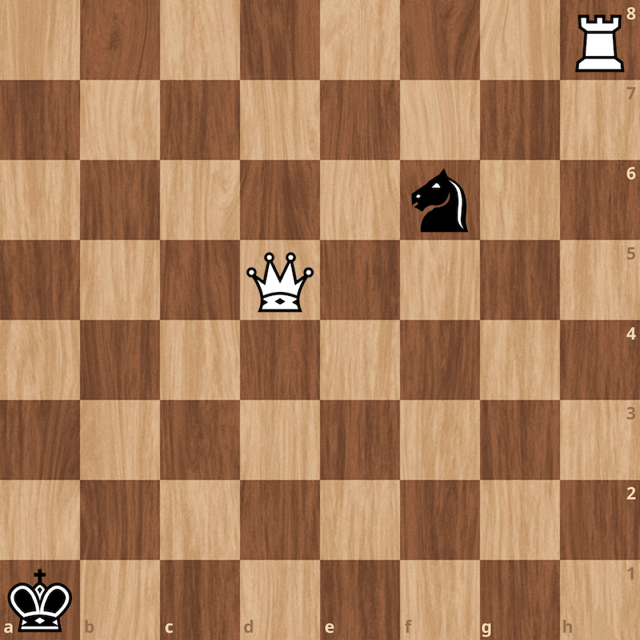

# Beta Chess Diagrams

This software is made with ❤️ by [thechessnerd](https://www.instagram.com/thechessnerd/) team.

Create `.png` chess diagrams with the help of Deno
[canvas API](https://deno.land/x/canvas@v1.4.1).

``` js
import { Position } from './mod.ts';

const p = new Position();
p.place('k', 'b', 'a1');
p.place('q', 'w', 'd5');
p.place('n', 'b', 'f6');
p.place('r', 'w', 'h8');

await Deno.writeFile("image.png", await p.picture("w"));
```



The rights of the `Alpha Chess` Set belong to **Eric Bentzen** and have been
legally purchased under the name of Zachary Saine. Do not use the chess set
if you do not own the rights.
